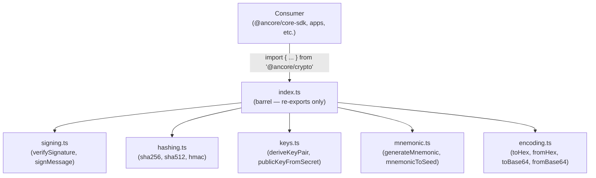
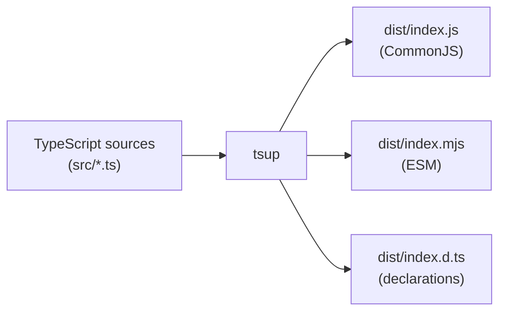

# Design Document: @ancore/crypto Package Integration

## Overview

The `@ancore/crypto` package is the single cryptographic entry point for the Ancore wallet monorepo. Currently it is a stub that exports only `CRYPTO_VERSION` and `verifySignature`. This design covers wiring the package together: updating `packages/crypto/src/index.ts` to re-export all public symbols from every submodule, and adding a smoke test that verifies the export surface is complete and correct.

The scope is **integration and export correctness only**. The internal logic of each submodule (`signing.ts`, `hashing.ts`, `keys.ts`, etc.) is implemented in separate issues (#065–#072). This design assumes those submodules will exist on disk when the index is updated.

Key design goals:

- One import path (`@ancore/crypto`) for all consumers — no internal path leakage.
- Clean TypeScript build producing CJS, ESM, and `.d.ts` outputs via `tsup`.
- A smoke test that acts as a living manifest of the public API surface.
- Zero secret material in logs or error messages.

---

## Architecture

The package follows a **barrel export** pattern. Each submodule owns its domain and explicitly marks its public surface with named exports. The index file is a pure re-export aggregator — it contains no logic of its own.



Build pipeline:



---

## Components and Interfaces

### index.ts — Barrel Export

The index is the only file consumers interact with. Its structure is:

```typescript
export const CRYPTO_VERSION = '0.1.0';

export * from './signing';
export * from './hashing';
export * from './keys';
export * from './mnemonic';
export * from './encoding';
```

Rules:

- Only `export *` or named `export { ... }` from submodules — no logic.
- If a submodule has name collisions, use explicit named re-exports with aliases.
- Internal helpers (e.g., `toMessageBytes`, `isHex`) must **not** be exported from their submodule's public surface.

### Submodule Contract

Each submodule must follow this contract so the barrel works correctly:

| Rule                         | Detail                                                          |
| ---------------------------- | --------------------------------------------------------------- |
| Named exports only           | No default exports — enables `export *` without ambiguity       |
| No console calls             | `console.log/warn/error` are forbidden in production code paths |
| No secret material in errors | Error messages must not include key bytes, seeds, or mnemonics  |
| Pure functions preferred     | Side-effect-free functions are easier to test and tree-shake    |

### Expected Submodules and Their Public Symbols

The table below defines the intended public API surface. It will be updated as issues #065–#072 land.

| Submodule     | Public Exports                               |
| ------------- | -------------------------------------------- |
| `signing.ts`  | `verifySignature`, `signMessage`             |
| `hashing.ts`  | `sha256`, `sha512`, `hmac`                   |
| `keys.ts`     | `deriveKeyPair`, `publicKeyFromSecret`       |
| `mnemonic.ts` | `generateMnemonic`, `mnemonicToSeed`         |
| `encoding.ts` | `toHex`, `fromHex`, `toBase64`, `fromBase64` |
| `index.ts`    | `CRYPTO_VERSION` + all of the above          |

### Smoke Test — `__tests__/smoke.test.ts`

The smoke test is a living manifest of the public API. It:

1. Imports the entire namespace from `@ancore/crypto`.
2. Asserts every expected symbol is defined.
3. Invokes at least one async function with valid inputs.
4. Spies on `console` methods to assert no output occurs.

```typescript
import * as CryptoAPI from '@ancore/crypto';

const EXPECTED_EXPORTS = [
  'CRYPTO_VERSION',
  'verifySignature',
  'signMessage',
  'sha256',
  'sha512',
  'hmac',
  'deriveKeyPair',
  'publicKeyFromSecret',
  'generateMnemonic',
  'mnemonicToSeed',
  'toHex',
  'fromHex',
  'toBase64',
  'fromBase64',
] as const;
```

---

## Data Models

This package is a utility library — it has no persistent state or database models. The relevant data types are:

```typescript
// Shared input type for signable values
type SignableValue = string | Uint8Array;

// Key pair returned by key derivation
interface KeyPair {
  publicKey: string; // Stellar-encoded G... address
  secretKey: string; // Stellar-encoded S... secret
}

// Result of mnemonic-to-seed derivation
interface SeedResult {
  seed: Uint8Array; // 64-byte BIP39 seed
  mnemonic: string; // space-separated word list
}
```

These types are defined in their respective submodules and re-exported through the index. They may also be shared with `@ancore/types` if needed by other packages.

---

## Correctness Properties

_A property is a characteristic or behavior that should hold true across all valid executions of a system — essentially, a formal statement about what the system should do. Properties serve as the bridge between human-readable specifications and machine-verifiable correctness guarantees._

### Property 1: All expected exports are defined

_For any_ symbol in the declared public API list, importing that symbol from `@ancore/crypto` should yield a value that is not `undefined`.

**Validates: Requirements 1.1, 1.3, 3.1, 5.2**

### Property 2: Export set matches the public API exactly

_For any_ key present in the module namespace imported from `@ancore/crypto`, that key should appear in the declared public API list — and conversely, every key in the declared list should appear in the namespace. The sets are equal.

**Validates: Requirements 1.4, 4.3**

### Property 3: No console output during normal operation

_For any_ call to an exported function with valid inputs, the `console.log`, `console.warn`, and `console.error` methods should not be invoked.

**Validates: Requirements 3.3, 4.1**

### Property 4: Error messages do not contain secret material

_For any_ exported function called with an invalid input alongside a known secret value (e.g., a random 32-byte seed), any error thrown or rejection returned should not include the secret value in its message string.

**Validates: Requirements 4.2**

### Property 5: Module resolution is idempotent

_For any_ named export from `@ancore/crypto`, importing the same symbol twice (in the same process) should yield the same reference (`===` equality), confirming stable module identity.

**Validates: Requirements 5.3**

---

## Error Handling

| Scenario                                       | Behavior                                                                                   |
| ---------------------------------------------- | ------------------------------------------------------------------------------------------ |
| Invalid public key passed to `verifySignature` | Returns `false` (already implemented) — never throws                                       |
| Malformed hex/base64 in encoding functions     | Throws a `TypeError` with a message describing the format issue, not the input value       |
| Invalid mnemonic passed to `mnemonicToSeed`    | Throws a typed `CryptoError` with a safe message                                           |
| Missing submodule at build time                | `tsup` / `tsc` fails with a module-not-found error identifying the missing file            |
| Secret material in error path                  | Forbidden — error messages must use placeholders like `"invalid key"`, never the key bytes |

A `CryptoError` class (or discriminated union) may be introduced in a future issue to give consumers typed error handling. For now, functions either return a safe value (like `false`) or throw a plain `Error` with a safe message.

---

## Testing Strategy

### Dual Approach

Both unit tests and property-based tests are used. They are complementary:

- **Unit tests** cover specific examples, integration points, and known edge cases.
- **Property tests** verify universal invariants across randomly generated inputs.

### Unit Tests

Located in `packages/crypto/src/__tests__/`. Existing tests (`verify-signature.test.ts`) remain unchanged. New file: `smoke.test.ts`.

Unit test focus areas:

- Specific valid/invalid input examples for each exported function.
- Edge cases: empty strings, zero-length buffers, all-zero keys.
- Error path assertions: confirm safe error messages.

### Property-Based Tests

Library: **`fast-check`** (TypeScript-native, works with Jest via `fc.assert`).

Install: `pnpm add -D fast-check --filter @ancore/crypto`

Configuration: each property test runs a minimum of **100 iterations**.

Each test is tagged with a comment referencing the design property:

```typescript
// Feature: crypto-utilities-package, Property 1: All expected exports are defined
fc.assert(
  fc.property(fc.constantFrom(...EXPECTED_EXPORTS), (symbol) => {
    expect(CryptoAPI[symbol]).toBeDefined();
  }),
  { numRuns: 100 }
);
```

### Property Test Mapping

| Design Property | Test Description                                                    | Pattern                  |
| --------------- | ------------------------------------------------------------------- | ------------------------ |
| Property 1      | For each symbol in EXPECTED_EXPORTS, it is defined in the namespace | Invariant                |
| Property 2      | Namespace keys === EXPECTED_EXPORTS (no extras, no missing)         | Invariant                |
| Property 3      | No console calls during valid function invocations                  | Invariant                |
| Property 4      | Error messages from invalid inputs don't contain the secret value   | Error condition          |
| Property 5      | Same symbol imported twice yields `===` reference                   | Idempotence / Round-trip |

### CI Integration

The existing `jest` setup in `jest.config.cjs` picks up all `*.test.ts` files under `src/__tests__/`. No additional infrastructure is needed — `fast-check` integrates directly with Jest's `it`/`test` blocks.
